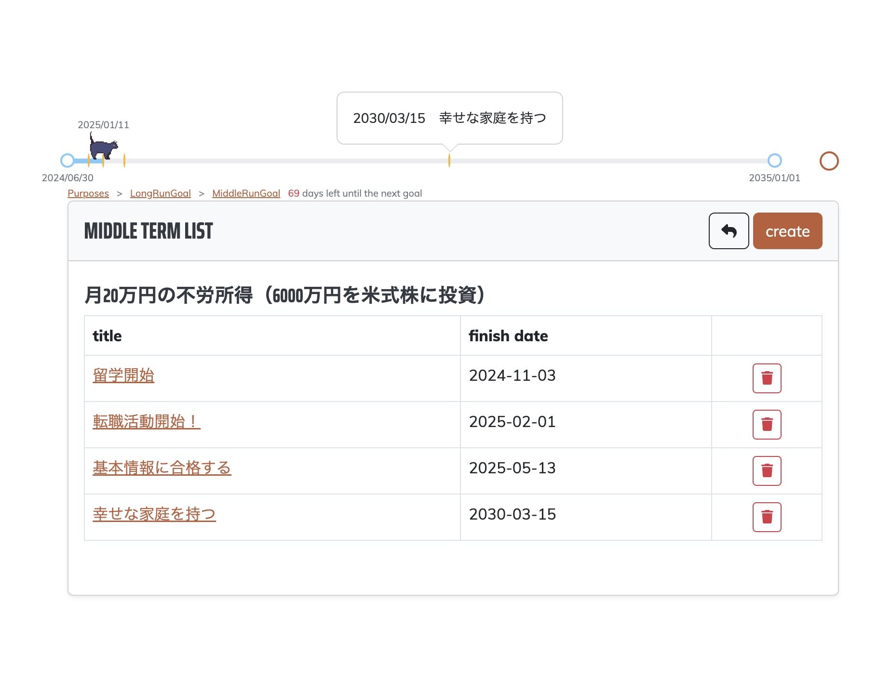
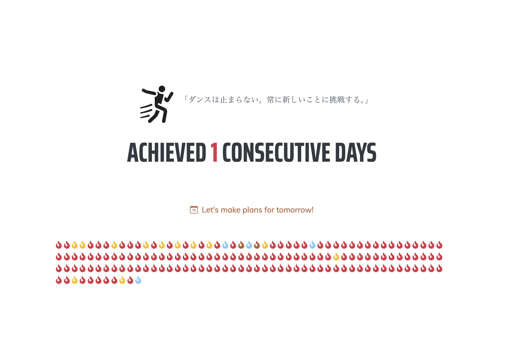
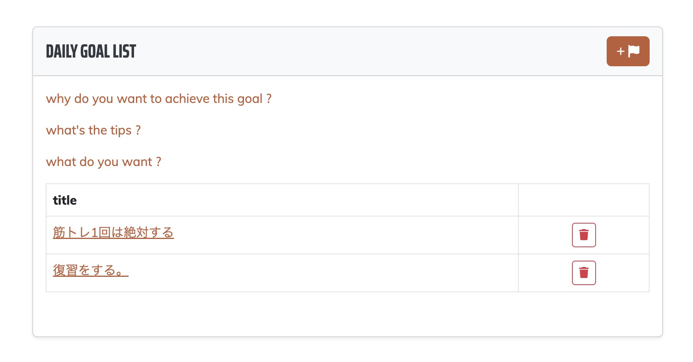
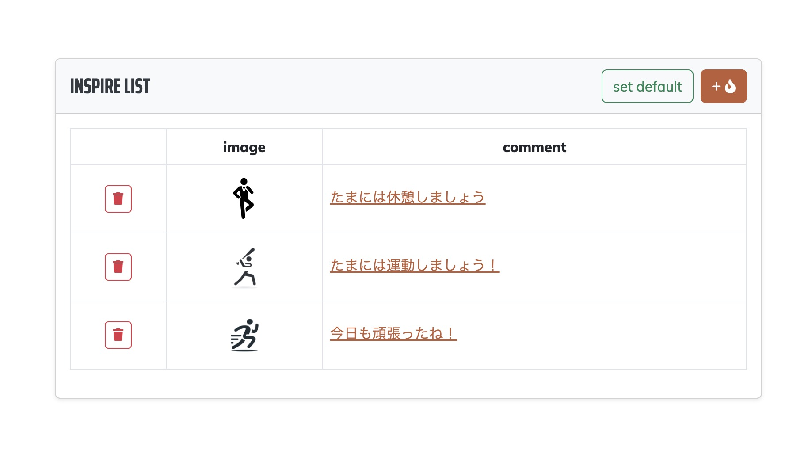
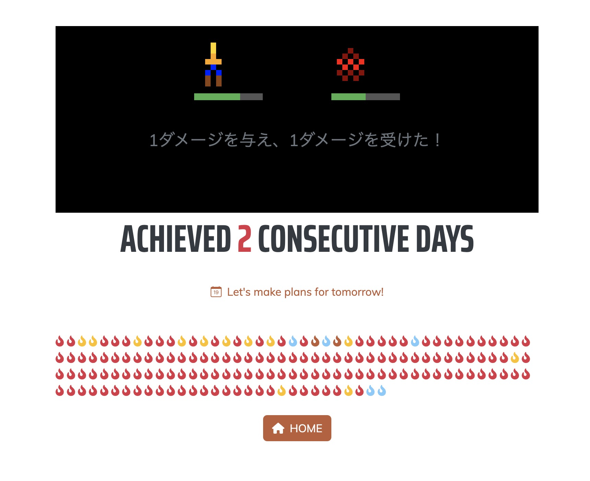
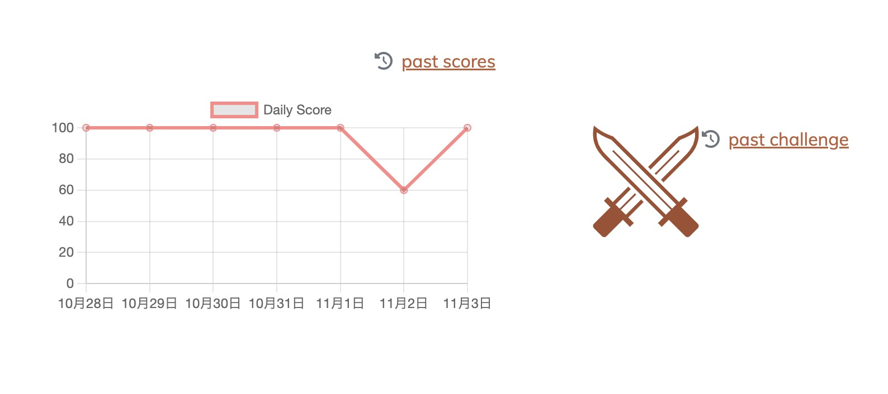
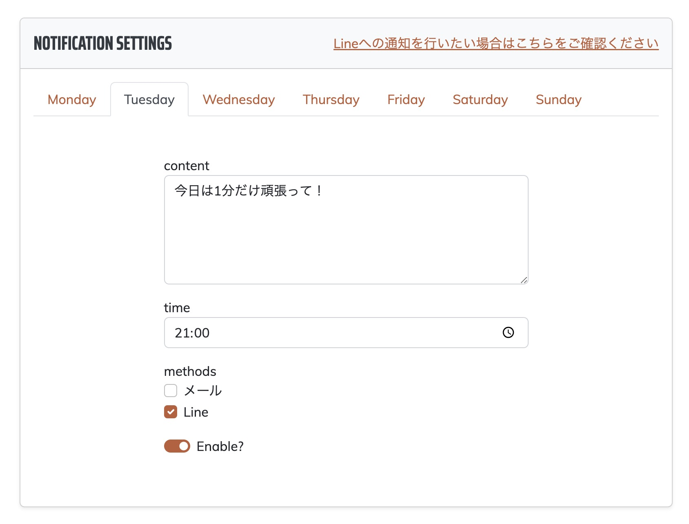

# MyApp

## 1. プロジェクトの概要 (Introduction)
### プロジェクト名や概要
- **プロジェクト名**: MyApp
- **概要**: 自分で自分を管理するアプリ

### 目的
- **MyApp** は目標を立て、その目標達成を手助けするアプリです。

---

## 2. 主な機能 (Features)
- 目的登録機能
- 長期目標登録機能
- 中期目標登録機能

- 今日の結果登録機能

- 毎日すること設定機能
- 動機登録機能（なぜこれをやろうと思ったのか原点を忘れないようにするため）
- コツ登録機能（達成するためのコツをメモする機能）
- 欲望登録機能（達成できたら何が欲しいか・どうなりたいかをメモする機能）

- 応援メッセージ登録機能（毎日の目標を達成した際に自分を励ます言葉を設定できる）

- プチRPG風景品獲得チャンス機能
  （ドラクエみたいにボスにダメージを与えていって、倒すと景品が手に入る機能）
  
  
  
- 毎日の記録一覧

- 応援メッセージ通知機能

- ログイン（メールアドレスログイン・Lineログイン）
- ログアウト

---

## 3. 開発者向け情報 (Development)

### 技術スタック
- **フロントエンド**: Vue.js, Vanilla JS
- **バックエンド**: Laravel 10
- **データベース**: MySQL
- **コンテナサービス**: Docker
- **デプロイ環境**: AWS Lightsail

### 開発フロー
- **CI/CDの導入**: GitHub Actions による自動テスト・デプロイフローを構築
- **コード整形**: `php-cs-fixer` を使用して PSR-12 準拠のコードフォーマットを適用
- **静的解析**: `Larastan`（PHPStanベース）を使用して潜在的なバグや非推奨コードを検出
